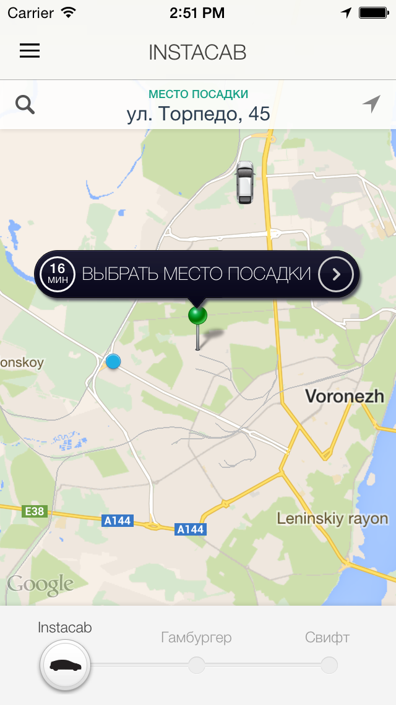
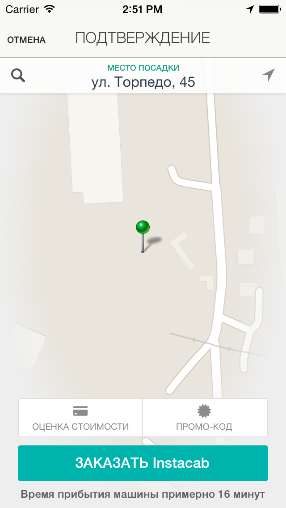
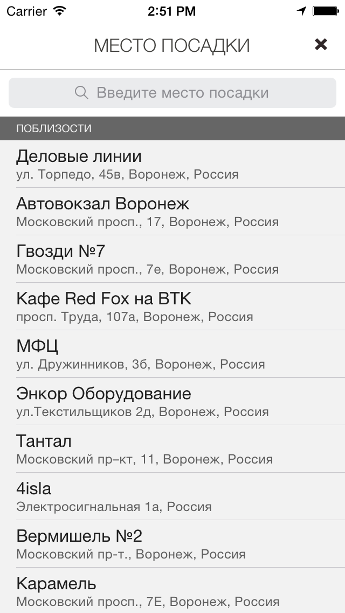
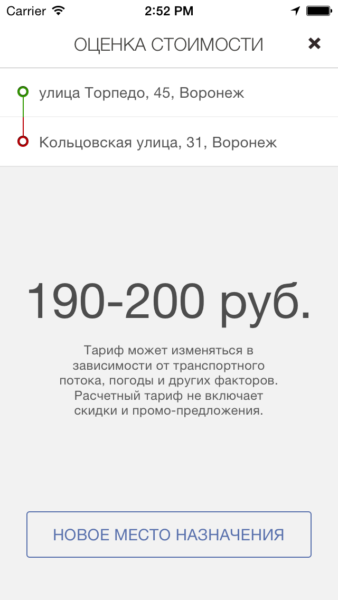
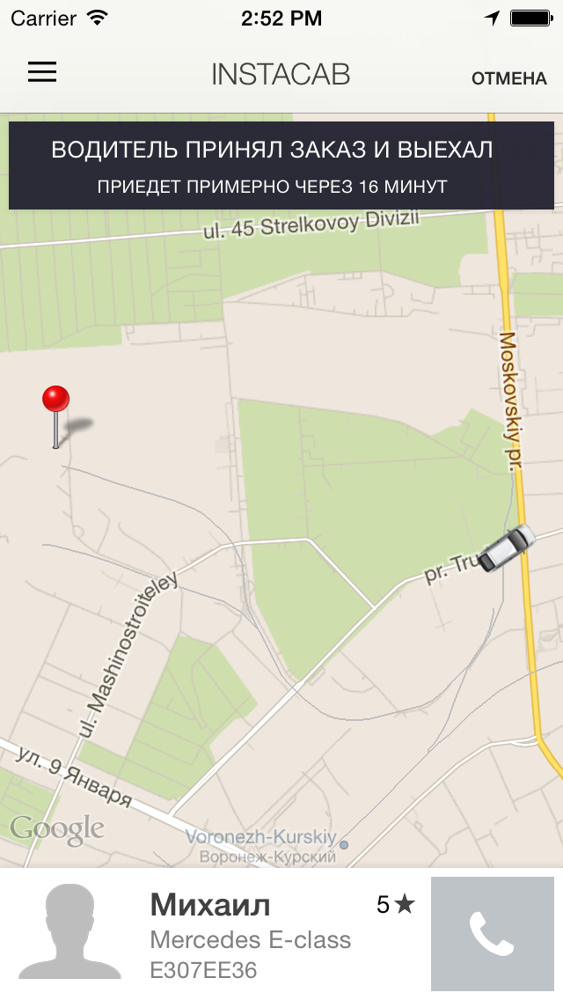
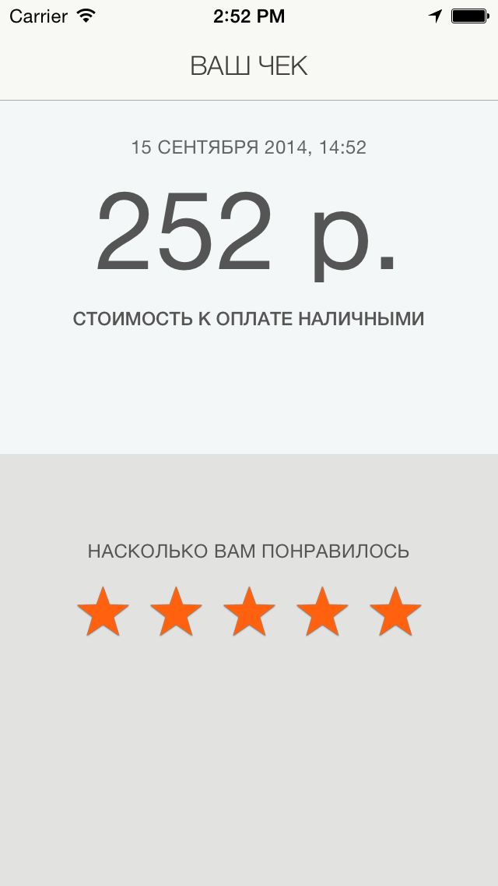
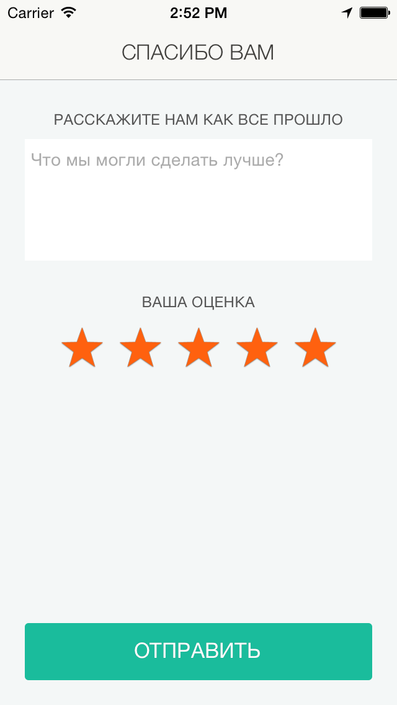

## Welcome to Instacab Client

Instacab is an iPhone app used to request cars, messengers and anything else much like Uber, with real-time progress tracking on the map, integrated payment and receipt after your ride or request is completed.

## This is What It Looks Like

<span style="margin-right:15px;margin-bottom:15px;display:inline">

</span>

<span style="margin-right:15px;margin-bottom:15px;display:inline;">

</span>

<span style="margin-right:15px;margin-bottom:15px;display:inline;">

</span>

<span style="margin-right:15px;margin-bottom:15px;display:inline;">

</span>

<span style="margin-right:15px;margin-bottom:15px;display:inline;">

</span>

<span style="margin-right:15px;margin-bottom:15px;display:inline;">

</span>

<span style="margin-right:15px;margin-bottom:15px;display:inline;">

</span>

## Requirements
* Latest version of XCode - download from https://developer.apple.com/xcode/.

## Getting Started

1. Checkout Instacab source at the command prompt if you haven't yet:

        git checkout https://github.com/tisunov/InstacabClient

2. At the command prompt, install required Cocapods packages:

        pod install

3. Register your [Google Maps API key](https://developers.google.com/maps/documentation/ios/start#obtaining_an_api_key) and insert it in `AppDelegate.m`

      ```Objective-C
        - (void)setupServices:(UIApplication *)application {
            // Google Maps key
            [GMSServices provideAPIKey:@"<YOUR GOOGLE MAPS API KEY>"];
      ```
  You need it otherwise app won't load Google Maps

4. (*optionaly*) Register your Mixpanel key for analytics, then insert development & production keys in `AppDelegate.m`

      ```Objective-C
        - (void)setupServices:(UIApplication *)application {
            ...
            // Mixpanel analytics
            [Mixpanel sharedInstanceWithToken:@"<YOUR MIXPANEL KEY>"];
      ```

5. (*optionaly*) Register your BugSnag key for crash reporting, then add it to `AppDelegate.m` `application:didFinishLaunchingWithOptions:` method:
  
      ```Objective-C
        [Bugsnag startBugsnagWithApiKey:@"<YOUR BUGSNAG API KEY>"];
      ```

6. Start Instacab Node.js Dispatcher
7. Start Instacab Rails Backend

## Setting Up Dispatcher

Please refer to [Instacab Dispatcher](https://github.com/tisunov/InstacabDispatcher/)

## Setting Up Backend

Please refer to [Instacab Backend](https://github.com/tisunov/Instacab/)

## TODO

- [ ] Write unit tests
- [ ] Remove Payture Payment Processor integration
- [ ] Cache remote images using Path's [FastImageCache](https://github.com/path/FastImageCache)
- [ ] Translate or remove Russian comments
- [ ] Validate promo code upon sign up
- [ ] Remove ReactiveCocoa dependency
- [ ] Consider ditching WebSockets in favor REST API, we are updating whole app state anyways.